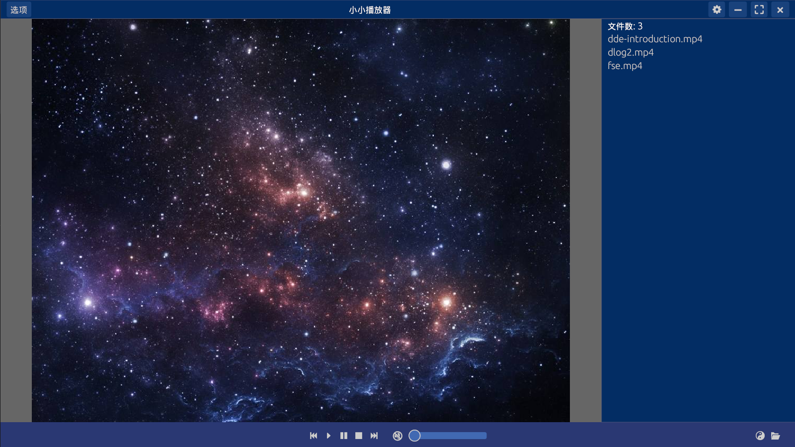

这是一个简单的FFMPEG播放器, 使用 bevy 和 egui 构建的 ui界面.

学习与实践是目的.

如果喜欢这个项目, 请 star 或 fork.

## 编译环境

### 安装FFMPEG

#### windows 10

需要安装 vcpkg:

    打开 powershell, 执行:

    git clone https://github.com/Microsoft/vcpkg.git
    cd vcpkg
    .\bootstrap-vcpkg.bat -disableMetrics
    .\vcpkg.exe integrate install

使用 vcpkg 编译 (我开了代理, 总共编译大概36分钟):

    .\vcpkg.exe install ffmpeg[ffmpeg,ffplay,ffprobe,x265,avcodec,avdevice,fdk-aac] --triplet x64-windows-static-md --recurse

#### ubuntu

?? 忘了环境是怎么配的, 这么装应该就可以了

sudo apt install ffmpeg

### 编译并运行

    如果是 debug 版本, 在执行 解码后的Rgb数据 转 egui的 Color Image时 会特别慢, release版本会有优化

    cargo run --release

## 学习记录

### 音视频同步

参考: [音视频同步](https://www.cnblogs.com/leisure_chn/p/10307089.html)

对于 一个44.1KHz的AAC音频流 (一秒声音中有44.1K个数据点), 每个声道可能包含1024个采样点, 即: 一帧声音中 需要采样 1024个数据, 那这一帧的时间就是
平均每个数据点的时间 乘以 采样数, 在乘以1000, 得到一帧音频数据的毫秒时间, 即: 1/44.1K * 1024 * 1000ms ≈ 23.22ms

#### time_base 时间基

    time_base是PTS和DTS的时间单位，也称时间基

    不同的封装(mp4 flv等) time_base也不相同

    从流中可以获取到时间基, 这表示基本单位, 用于后面 显示时间的计算
    AVRational tb = is->p_video_stream->time_base;

    当前帧的帧速率, 表示 1秒多少帧
    AVRational frame_rate = av_guess_frame_rate(is->p_fmt_ctx, is->p_video_stream, NULL);

    // 根据帧速率 算一下 两帧时间间隔, 即 当前帧播放时长
    duration = (frame_rate.num && frame_rate.den ? av_q2d((AVRational){frame_rate.den, frame_rate.num}) : 0);
    
    // 计算显示时间, 即 当前帧显示时间戳
    pts = (p_frame->pts == AV_NOPTS_VALUE) ? NAN : p_frame->pts * av_q2d(tb);

### AV_DISPOSITION_ATTACHED_PIC

判断流中绑定了图片

    av_stream.disposition & AV_DISPOSITION_ATTACHED_PIC

对于一个有封面的mp3文件, 它可以包含 audio stream 和 video stream, 它的 video stream 中只包含了一个包, 那么就可以通过 video_stream.disposition 判断这个流中保存了一个绑定图片, 同时不应该向这个

学习自: [FFmpeg小点记】AV_DISPOSITION_ATTACHED_PIC](https://segmentfault.com/a/1190000018373504)

显示音视频文件的Packages信息

    ffprobe -show_packets -of json -i quliulang.mp3 > packets.json

WGPU_BACKEND=gl